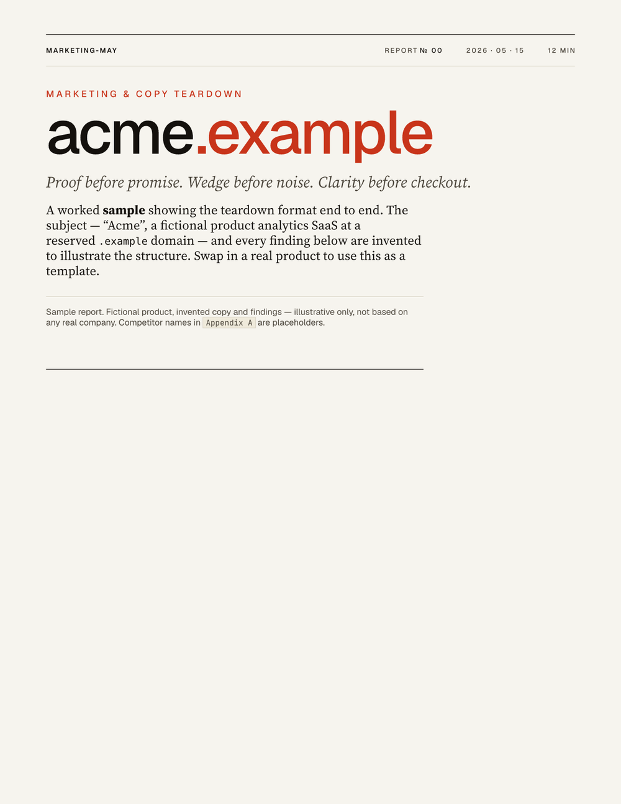
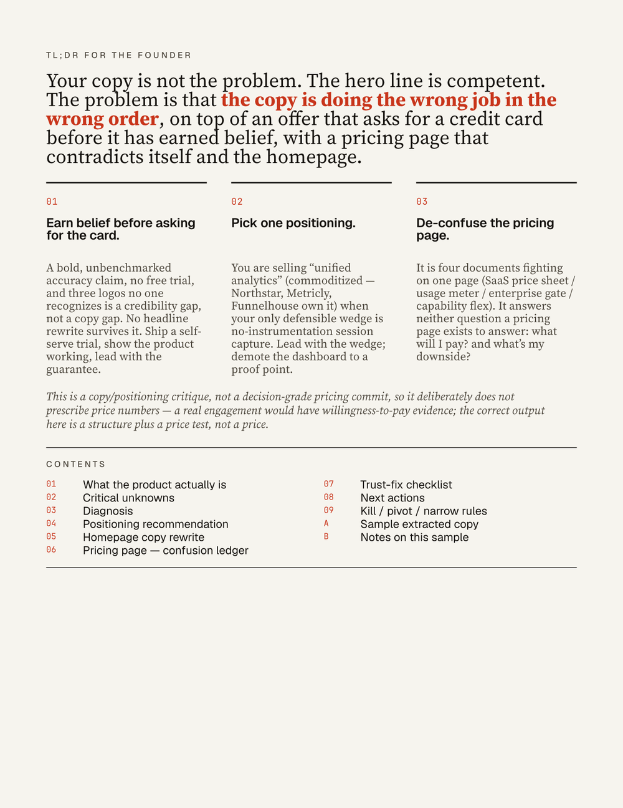

# /marketing-may

Agent skill for doing data-driven marketing.

Run it on your project without additional prompting to get a review of the
marketing posture of your project with actionable next steps. See the examples
below for more advanced usage.

## Install

```shell
npx skills add bobisme/marketing-may
```

## How to Use

The skill auto-loads when your prompt mentions marketing, positioning, messaging, copy, landing pages, ads, pricing, channels, funnels, retention, experiments, customer discovery, competitive research, or growth decisions.

## Beautiful PDF reports

Ask for a **report** and you get one — a typeset, editorial PDF, not a wall of Markdown. When you request a *report*, *PDF*, or *shareable deliverable* (a teardown, pricing review, or competitive analysis as a document), the skill renders it with a bundled [Typst](https://typst.app) template: paper-white editorial layout, real typefaces, hairline tables, the critical-unknowns ledger, kill/pivot rules, and appendices — the skill's own analysis structure, typeset. No Typst install required: the renderer fetches a pinned static binary on first use, and nothing leaves your machine (reports are confidential).

> Use /marketing-may — produce a marketing & copy teardown of https://your-site.com as a PDF report.

Example output — the bundled sample, [`docs/example-report.pdf`](docs/example-report.pdf) (cover and TL;DR/contents pages):

<p align="center">
  
  
</p>

Or render one yourself from structured content — see the authoring API in [`typst/`](typst/):

```shell
typst/bin/render your-report.typ out.pdf
```

## Example prompts

The skill routes by intent. Below are prompts that exercise each branch — copy, adapt, or paste your own context.

Add "Use /marketing-may" (claude) or "Use $marketing-may" (codex) to these examples to ensure the skill gets triggered.

### Segmentation, ICP & JTBD

- "Help me pick a segment to focus on. We're a Postgres slow-query tool selling to backend engineers, marketing managers, and DBAs — we can't tell which buyer to commit to."
- "Score these 4 segments for us: solo founders, seed-stage CTOs, Series A platform teams, enterprise DBAs."
- "Write an ICP and JTBD map for a hosted Temporal alternative."

### Positioning & messaging copy rewrite

- "Rewrite my hero section. Current copy: '<paste>'. We sell observability for ML inference."
- "Our landing page isn't converting. Here's the URL / here's the copy — diagnose and rewrite."
- "Give me a positioning statement. Category, buyer, alternative, differentiation, proof, sales motion."
- "Mine this VOC dump for buyer language" (paste reviews / interview notes / support tickets — runs `message_miner.py`).
- "Lint this landing-page copy" (runs `copy_lint.py` against vague adjectives, unsupported superlatives, dark patterns, hidden price, missing CTA).

### Pricing & offer

- "What should I charge for a self-serve Postgres slow-query tool?" (will refuse a number without WTP evidence; returns a test design instead).
- "Here's a Van Westendorp CSV from 42 respondents — what does it say?" (runs `pricing_research_analyzer.py`).
- "Design a pricing test. We're considering $49 / $99 / $199 monthly."
- "Critique our packaging — Free / Pro $29 / Team $99 / Enterprise call us."

### Competitive intel

- "Are competitors eating us? Direct rivals: Datadog DBM, pganalyze. Substitutes: RDS Performance Insights, manual EXPLAIN."
- "Tear down pganalyze, Datadog DBM, and RDS Performance Insights — features, price, ICP, positioning, gaps."
- "Build a competitor matrix from this CSV" (runs `competitor_matrix.py`).
- "Find the whitespace in the Postgres tooling category."

### Funnel, activation & retention

- "Why isn't our funnel converting? Here's signup → activated → paid for last 90 days."
- "Analyze this funnel CSV by segment" (runs `funnel_analyzer.py`).
- "Are users sticking around? Here's cohort × week event data" (runs `retention_analyzer.py` for plateau/declining/flattening verdict).
- "Pick our activation event. We're a usage-based API product."
- "Design an event taxonomy that survives a rewrite."

### Metric trees & north-star

- "What should our north-star metric be? We're a two-sided marketplace for dog walkers."
- "Build a metric tree for a sales-led B2B SaaS at $40k ACV."
- "Give me the starter metric tree for OSS-led commercial."

### Experiments & stats

- "Should we run this test? Variant A vs. variant B on the pricing page, ~3,800 weekly visitors." (will refuse frequentist at low traffic and route to Bayesian).
- "How big a sample do I need to detect a 2pp lift on a 6% baseline?" (runs `stats_cli.py sample-size`).
- "We just shipped a test — here's the result. 412 / 9,103 vs. 478 / 9,088. Read it." (runs `stats_cli.py srm` + `bayes`).
- "Rank these 12 experiments by Expected Learning Value" (runs `experiment_prioritizer.py`).
- "Write an experiment plan with pre-registered decision rules."

### Channels & outbound

- "Pick a channel for us. ACV $1.2k, 0 brand, 1 founder, no budget."
- "Draft a cold-outbound playbook for platform engineers at 200–2,000-person companies."
- "Score this account list against our ICP" (runs `outbound_list_scorer.py` for A/B/C tiers).
- "Should I sponsor this newsletter? 38k subs, $4,200, dev audience." (uses 2026 CPM bands).
- "How do I get cited by ChatGPT / Perplexity for queries in my category?" (loads `modern_channels.md` AEO/GEO patterns).

### Marketplaces

- "We're building a marketplace for X. Where do we start?" (loads `marketplace_network.md` cold-start playbook).
- "What's the liquidity target we should be hitting at week 12?"
- "We have supply but no demand — what's the next move?"

### Kill / pivot / narrow

- "Are we kidding ourselves? Here's 6 months of data: 14 paying customers, $890 MRR, 11% monthly churn, CAC $740."
- "Should we kill this product? Should we narrow? Should we pivot? Here's the evidence."
- "Pre-register a kill rule for the next 8 weeks."

### Customer discovery

- "I want to run customer interviews. Write me a switch-interview script."
- "Here are 5 interview transcripts — extract pain, outcome, objection, trigger, alternative, proof."
- "Design a commitment menu for ICP-validation calls."

### "I have no idea where to start" (vague growth questions)

- "Help me grow this thing."
- "How do I market this?" → triggers workshop mode: runs `00_product_intake` interactively, asks one question at a time, refuses to draft assets until ICP and dominant alternative are named.

### Worked examples

- "Show me a worked example for an indie devtool getting to revenue."
- "Show me the marketplace cold-start case study."

## Response modes

Phrasing shifts the response shape:

- **Quick mode** (default, ≤400 words) — short question, no data. Always opens with a "Critical unknowns" table, then a one-paragraph diagnosis, smallest artifact, ≤5 next actions, one kill rule.
- **Deep mode** — paste data, ask for a plan, or name a timeline ("here's our funnel CSV — give me a 30-day plan").
- **Workshop mode** — paste an intake, or ask "where do we start?" — agent runs the intake template interactively.

Decision-grade questions (pricing commits, channel scaling, kill/pivot, hiring) additionally emit a JSON evidence ledger with kill rules per claim — regardless of mode.

## Features

### Decision frameworks (references)

- **Segmentation, ICP & JTBD** — qualification ladder, segment scoring, buyer-psychology / objection model.
- **Positioning & messaging** — category-strategy decision tree, positioning system, message hierarchy, hero-formula bank, copy quality checklist.
- **Pricing & offer design** — pricing-model decision table, value-metric fit score, WTP evidence ladder, risk-reversal menu.
- **Competitive intel** — research table, gap taxonomy, four-group competitor set (direct / adjacent / substitutes / aspirational).
- **Channels & cold outbound** — sales-motion decision tree, ACV/channel fit heuristic, channel-fit scoring, outbound thresholds and template.
- **Modern channels** — AI search / AEO / GEO citation patterns, podcast sponsorship math (2026 CPMs), community playbooks for Discord/Slack/Reddit, newsletter sponsorships.
- **Marketplace & network effects** — cold-start playbook, liquidity targets by marketplace type, take-rate ranges, disintermediation defenses.
- **Customer discovery** — interview rules, structure, commitment menu.
- **Experiments** — experiment types, ELV scoring, kill/pivot/narrow rules, decision-rule pre-registration.
- **Funnel analytics** — stage model, activation event selection, event taxonomy rules, attribution caveats.
- **Metric trees** — pre-built starter trees for self-serve SaaS, usage-based / API, marketplace, OSS-led, course/community, sales-led B2B, e-commerce.
- **Stats primer** — when to A/B test, when to refuse, sample-size sanity, SRM as precondition, Bayesian small-traffic guidance.
- **Browsing recipe** — per-page extraction shapes for competitor homepages, pricing pages, reviews, search/AI-search citations, with stopping rules.
- **Compliance & ethics** — never-recommend list, substantiation, dark-pattern avoidance.
- **Decision trees** — "what next?", "which test?", "should we scale this channel?".
- **Algorithms & practice digest** — evidence tensor, segment attractiveness, offer-market fit, category gravity, objection entropy, proof debt, copy-claim risk filter; field rules in compact form.

### Templates

Fillable templates for product intake, customer-discovery interviews, ICP/JTBD/segment maps, competitive teardowns, positioning + messaging + copy, pricing/packaging/offer, funnel instrumentation, experiment plans, channel strategy, kill/pivot/narrow decisions, and asset specs.

### JSON schemas

Validatable schemas for competitor teardowns, event taxonomies, experiment plans, marketing assets, pricing research, and an evidence ledger for tracking each load-bearing claim's source, behavioral strength, and kill rule.

### Scripts (Python, no third-party deps unless noted)

- `competitor_matrix.py` — summarize competitor research CSV into category norms, gap counts, and whitespace prompts.
- `experiment_prioritizer.py` — rank experiments by Expected Learning Value with a decision hint per row.
- `funnel_analyzer.py` — ordered funnel conversion + drop-off, optional segment grouping.
- `retention_analyzer.py` — cohort × week-N retention table with directional curve-shape verdict (plateau / flattening / declining).
- `message_miner.py` — extract repeated buyer language from voice-of-customer text; bucket by pain / outcome / objection / trigger / alternative / proof.
- `pricing_research_analyzer.py` — Van Westendorp and Gabor-Granger directional analysis with segment cuts.
- `outbound_list_scorer.py` — score account CSV against weighted ICP criteria (firmographic / tech / role / recency-bounded triggers / negatives) and rank into A/B/C tiers.
- `stats_cli.py` — A/B test sample size, sample-ratio mismatch (Microsoft p<0.0005 threshold), Bayesian Beta-Binomial P(B>A) with credible interval and expected-loss decision aid.
- `copy_lint.py` — mechanical check of marketing copy for vague adjectives, unsupported superlatives, dark-pattern urgency, hidden price, weak social proof, missing CTA, buzzword density. Supports inline `<!-- lint:ignore <rule> -->`.
- `validate_artifact.py` — validate any JSON artifact against the corresponding schema; auto-detects schema by filename.

### Worked case studies

Two filled walk-throughs (synthetic but realistic) showing the full skill flow from intake through decision: an indie devtool reaching $3.4k MRR, and a two-sided marketplace narrowing to first 50 transactions.

### Quality layer

- 83-test pytest suite covering every script (sample-size formula, SRM detection, Bayesian determinism, funnel ordering invariant, Van Westendorp edge cases, copy-lint rules, retention curve helpers, outbound recency windows).
- Pyright-friendly with `pyrightconfig.json`.
- `just test` / `just test-quiet` / `just setup-dev` recipes.
